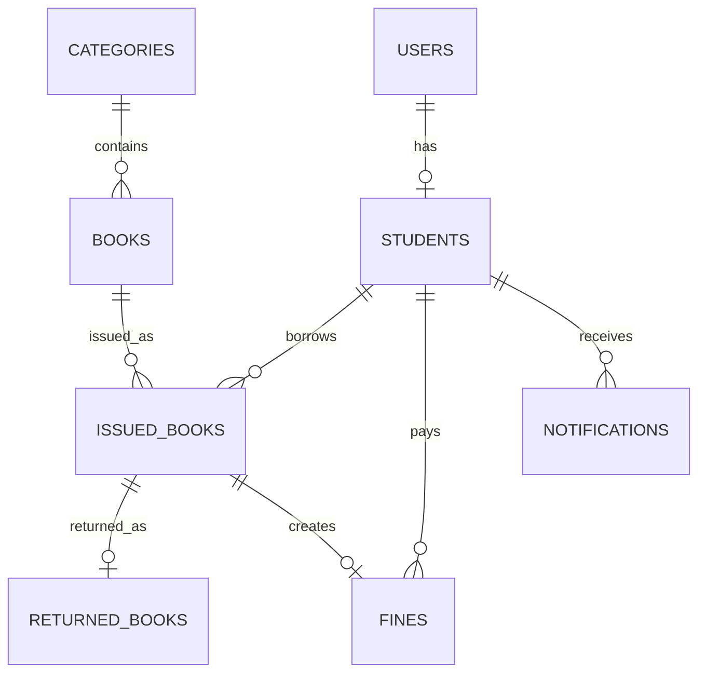
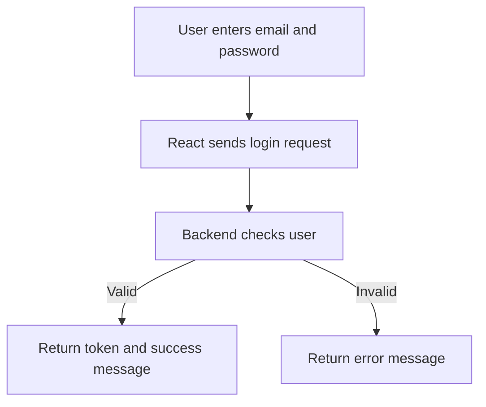
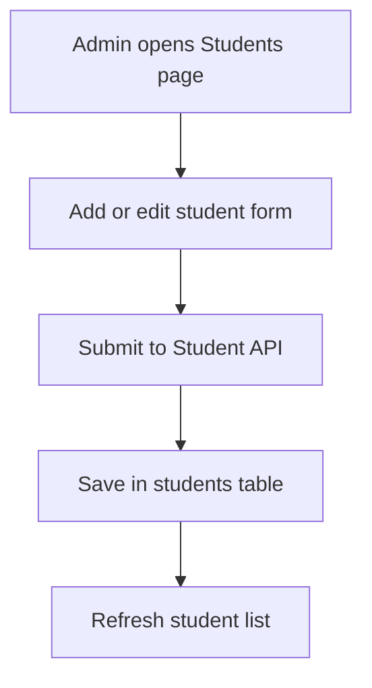
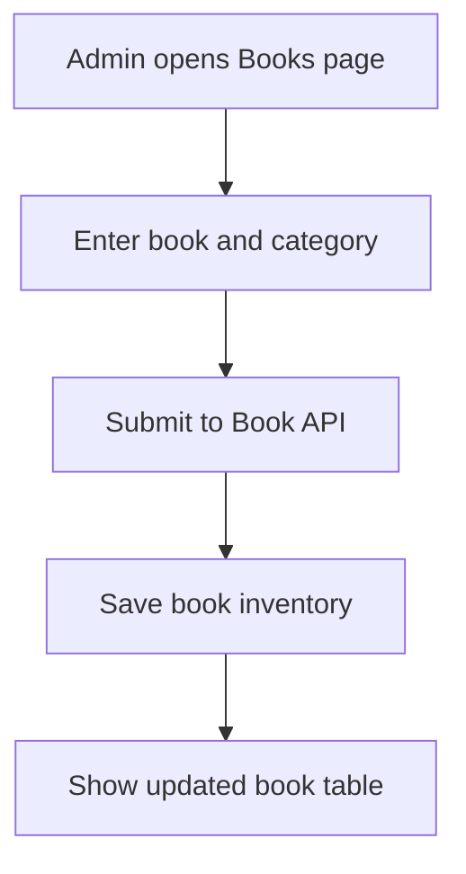
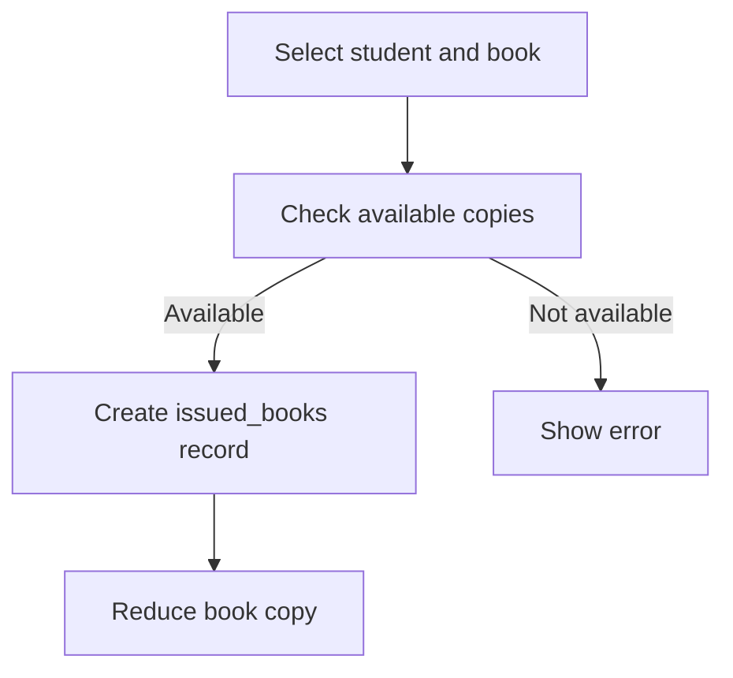
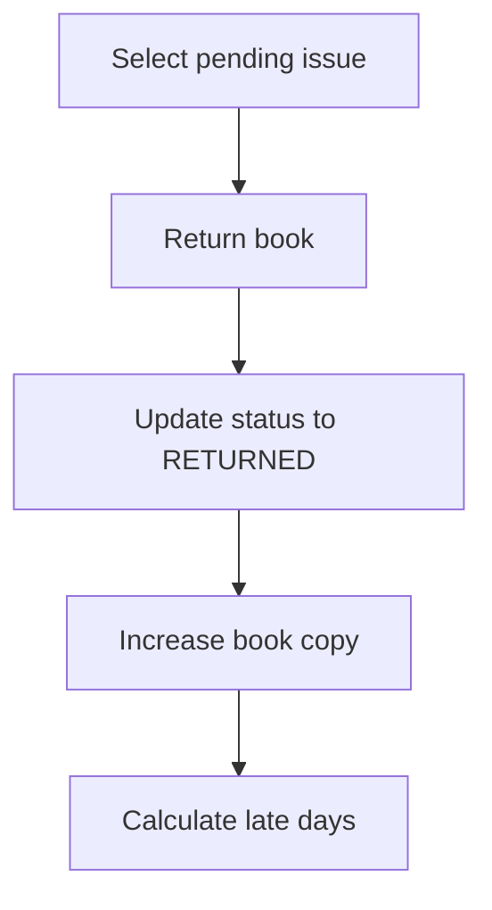
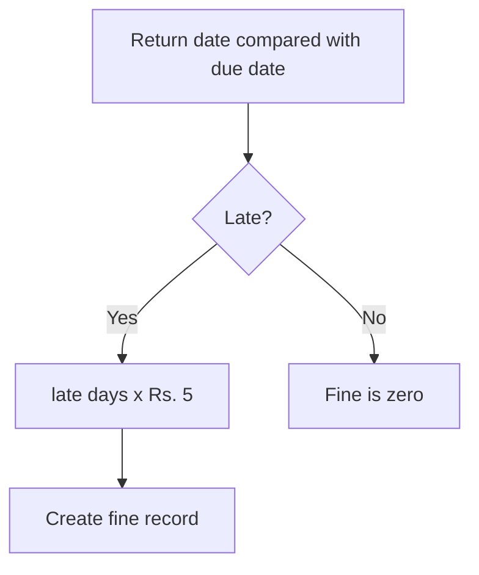
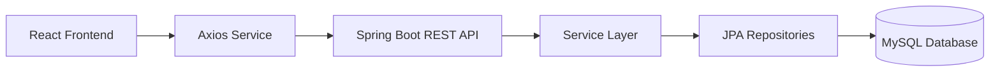
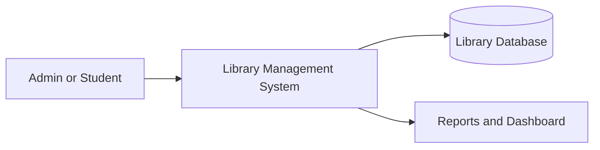
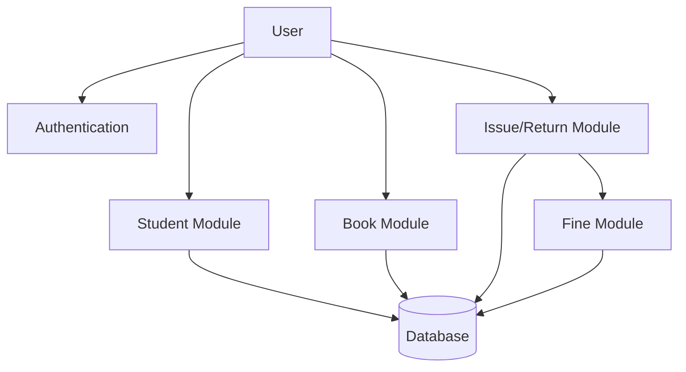

# Online Library Management System Documentation

## Phase 1: SRS

### Introduction
Online Library Management System is a Java Spring Boot and React project for managing students, books, categories, issue records, return records, fines, and dashboard reports.

### Purpose
The purpose of this project is to help an academic library replace manual registers with a simple web application.

### Scope
Admin can manage students, books, categories, book issue, book return, fines, and reports. Student users can login, view books, view issue history, and check fine details.

### Objectives
- Maintain student and book records.
- Track book availability.
- Issue and return books.
- Calculate fine at Rs. 5 per late day.
- Show dashboard statistics and basic reports.
- Keep code clean and beginner-friendly.

### Functional Requirements
- User registration and login.
- Student CRUD.
- Book CRUD.
- Category CRUD.
- Issue book to a student.
- Return issued book.
- Auto fine calculation.
- Fine payment status update.
- Dashboard analytics.
- Report summary pages.

### Non Functional Requirements
- Responsive UI.
- REST API architecture.
- MySQL for production data.
- H2 for automated tests.
- Layered backend structure.
- Basic validation and global exception handling.

### User Roles
- ADMIN: Full access to all modules.
- STUDENT: View books, profile, issued books, returned books, and fines.

## Phase 2: Database Design

### Tables
- `users(email, name, password, role, active)`
- `students(id, first_name, last_name, email_id, course, roll_number, active, user_email)`
- `categories(category_id, name, description)`
- `books(book_id, title, author, isbn, publisher, book_copy, category_id)`
- `issued_books(issue_id, book_id, student_id, issue_date, due_date, status)`
- `returned_books(return_id, issue_id, return_date, late_days, fine_amount)`
- `fines(fine_id, student_id, issue_id, amount, status, created_date)`
- `notifications(notification_id, student_id, message, read_status, created_at)`
- `audit_logs(log_id, action, username, created_at)`

### ER Diagram


### Normalization
Student, book, category, issue, return, and fine information are stored in separate tables. Repeating values such as category names are not stored inside books repeatedly; they are referenced using foreign keys.

## Phase 3: Backend Development

### Backend Structure
```text
LibraryManagement/src/main/java/com/library/backends
├── controller
├── dto
├── entity
├── exception
├── mapper
├── repository
├── request
├── service
└── service/impl
```

### Important APIs
```text
POST   /api/auth/register
POST   /api/auth/login
GET    /api/dashboard
GET    /api/students
POST   /api/students
PUT    /api/students/{id}
DELETE /api/students/{id}
GET    /api/books
POST   /api/books
PUT    /api/books/{id}
DELETE /api/books/{id}
GET    /api/categories
POST   /api/categories
PUT    /api/categories/{id}
DELETE /api/categories/{id}
POST   /api/issues
GET    /api/issues
POST   /api/returns/{issueId}
GET    /api/returns
GET    /api/fines
PUT    /api/fines/{fineId}/paid
```

### Login Request
```json
{
  "email": "student@test.com",
  "password": "123456"
}
```

### Issue Book Request
```json
{
  "studentId": 1,
  "bookId": 2,
  "dueDate": "2026-07-11"
}
```

## Phase 4: Frontend Development

### Frontend Structure
```text
lms-fronted/src
├── App.jsx
├── App.css
├── index.css
├── main.jsx
└── services/StudentService.js
```

### Pages
- Login and register form in Profile page.
- Admin dashboard.
- Student management.
- Book management.
- Category management.
- Issue book.
- Return book.
- Fine management.
- Reports.
- Profile.

### UI Mockup Notes
- Sidebar navigation on desktop.
- Single-column layout on mobile.
- Dashboard cards at top.
- Forms on the left and data tables on the right.
- Simple report cards for academic presentation.

## Phase 5: Security

The current project includes simple login and a beginner-friendly token response. For a production version, add Spring Security with JWT filter, password hashing using BCrypt, and route-level role checks for ADMIN and STUDENT.

## Phase 6: Testing

### Testing Strategy
- Unit tests for service methods.
- Integration tests for controller APIs.
- H2 database for test profile.
- Manual API testing with Postman.
- Frontend build testing with `npm run build`.

### Sample Test Cases
| Test Case | Input | Expected Result |
| --- | --- | --- |
| Add student | Valid student JSON | Student saved |
| Add duplicate email | Existing email | Validation/database error |
| Issue book | Valid student and book | Issue record created and copy reduced |
| Return late book | Due date before today | Return record and fine created |
| Mark fine paid | Fine id | Fine status becomes PAID |

## Phase 7: Deployment

### Backend
1. Create MySQL database: `CREATE DATABASE lms;`
2. Set environment variables:
   - `DB_URL=jdbc:mysql://localhost:3306/lms`
   - `DB_USERNAME=root`
   - `DB_PASSWORD=your_password`
3. Run: `mvn spring-boot:run`

### Frontend
1. Go to `lms-fronted`.
2. Run: `npm install`
3. Run: `npm run dev`
4. Open `http://localhost:3000`

## Workflow Diagrams

### Login Workflow


### Student Management Workflow


### Book Management Workflow


### Book Issue Workflow


### Book Return Workflow


### Fine Calculation Workflow


## System Architecture


## DFD Level 0


## DFD Level 1

